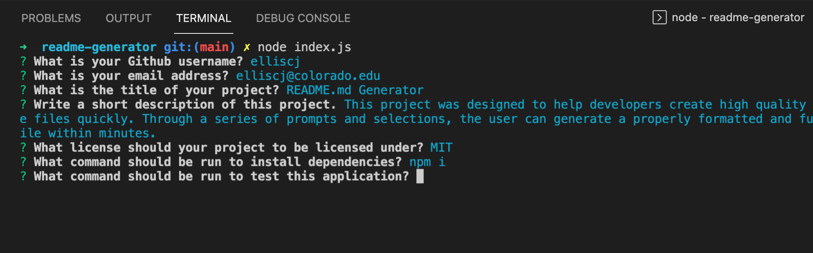

# Readme.md Generator

## Description

This project was built to help developers generate readmes

## Table of Contents

- [Installation](#installation)
- [Usage](#usage)
- [Tests](#tests)
- [Contributing](#contributing)
- [License](#license)
- [Link](#link)
- [Screenshot](#screenshot)
- [Questions](#questions)

## Installation

    npm install inquirer

## Usage

Once the app is cloned, node index.js

## Tests

n/a

## Contributing

contributor covenant

## License

This project is licensed under the GPL license. (c) 2021

## Link

N/a

## Screenshot

## Questions

#### If you have questions or would like to contact me for more information, you can find me on Git Hub or send me and email.

- https://github.com/elliscj 
- elliscj@colorado.edu